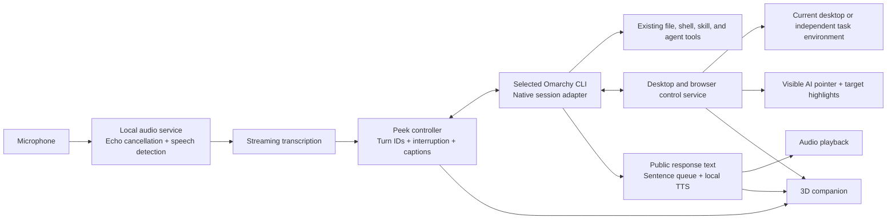

# Peek mode — implementation plan

Status: implemented in source and packaged as Side Chat 1.3.0 on 2026-09-05. The local runtime, speech models, Qt Quick 3D, and browser CLI are installed. See README.md for current behavior and THIRD_PARTY.md for licenses. The original design and research below are retained as rationale; this status supersedes their pre-implementation wording.

Implemented: native OMP/Pi/Codex/Claude adapters, session recovery, tool/approval UI, terminal continuation, local Parakeet streaming recognition (reusing Voxtype models), Pocket/Kokoro speech, advanced model/audio/control settings, PipeWire echo cancellation, push-to-talk/hands-free settings, interruption and Stop, desktop input broker, fractional-display coordinate validation, user takeover, themed AI pointer, visible default desktop browser / isolated headless browser, and original animated Qt Quick 3D companion. Local speech runs without a cloud service or Docker.

Verified: 50 automated tests; actual OMP/Codex/Claude config edits and computer-tool calls; Codex/Claude resume and native branching; full synthetic audio → OMP → spoken response using virtual PipeWire devices with default devices unchanged; independent browser typing/clicking/AI marker; native click and Unicode input plus physical takeover. Speech component timings are recorded in README.md.

Remaining extensions and validation: a separate full Linux desktop (the independent environment currently covers Chromium), AT-SPI semantic control, wake-word activation, all-local agent-model benchmarking/profile, non-English speech, room AEC/barge-in tuning, and prolonged multi-monitor/drag/scroll reliability testing. Existing hosted CLI models retain their own costs; none was silently changed.

## Product contract

Peek is another interface to the user's selected Omarchy CLI agent. A Chat/Peek toggle replaces the conversation body with an animated 3D companion, live captions, and compact voice controls. The same conversation, tools, working folder, permissions, history, and terminal handoff remain available.

It must support natural speech, spoken replies, interruption, real desktop mouse/keyboard actions, and a visible indication of those actions. It must retain the current screen-connected silhouette, Omarchy palette, font, and scaling.

All new Peek software must be free and open source. Speech has no paid/cloud fallback. Assets and model weights need separately verified redistribution licenses; source code being open does not automatically license bundled voices or models.

Agent selection remains independent. OMP, Pi, Codex, Claude, and other defaults can be supported through capability-tested adapters. Claude is proprietary; a hosted model may use a paid account. Those are optional user-selected integrations, not dependencies of the free stack. A zero-API-fee configuration uses an open-source CLI with a locally served model. Peek must never silently change the Omarchy default, provider, or model. Whether to replace the user's current hosted model is still a user decision.

## Findings on this computer

- Ryzen AI 9 HX 370, 24 logical CPUs, Radeon 890M-class integrated graphics, about 91 GiB usable RAM.
- Hyprland 0.56.2, Quickshell, Qt Multimedia, PipeWire, WirePlumber, `grim`, and `wtype` are present.
- Both displays use fractional scaling: 1.6 and 2.25. Screen coordinates need explicit transforms and monitor-change invalidation.
- Ollama/ROCm are installed; `ollama list` currently contains no models. GPU/NPU acceleration and end-to-end latency have not been benchmarked. RAM capacity alone does not establish inference speed.
- Docker Engine 29.7.2 is installed and its daemon is accessible. Containers are authorized where useful; none have been started for this proposal.
- Qt Quick 3D and the shortlisted speech engines are not installed.
- The installed Hyprland portal provides Screenshot, ScreenCast, GlobalShortcuts, and InputCapture, but no RemoteDesktop interface. This does not prevent mouse/keyboard automation: compositor virtual-input protocols or Linux uinput provide separate routes.
- The current app has persistent OMP/Pi RPC sessions, tool activity, approval UI, and terminal handoff. Codex and Claude currently use text adapters and require additional native integration.

## Recommended architecture

The controller coordinates components; it is not a second agent making decisions behind the user's selected CLI. Avoid a separate conversational model that merely delegates to the CLI and maintains a competing history.

Keep audio inference and input injection out of the Omarchy shell process. Use supervised local workers and private Unix sockets. Audio can use bounded shared buffers or local PCM streams; do not send continuous audio as JSON/base64 through the current chat event pipe.

### Optional Docker deployment

Use Docker Engine with an optional Compose setup for services that benefit from pinned dependencies or a separate task environment. Docker Desktop and paid container services are not required. Containerization does not change the selected CLI or require moving its authentication into a container.

| Component | Preferred location | Integration |
| --- | --- | --- |
| QML panel, companion, AI pointer | Host | Native Quickshell surfaces, Omarchy theme and display geometry |
| Microphone, playback, echo cancellation | Host | PipeWire worker sends bounded PCM streams to inference workers |
| Selected CLI and session ownership | Host initially | Preserve existing tools, credentials, working folder, and terminal resume |
| STT/TTS inference | Optional containers | Private local endpoint, persistent model cache, warm workers while armed |
| Local agent model server | Existing host Ollama initially; optional container | Reuse an available server instead of starting a duplicate; benchmark AMD acceleration separately |
| Host desktop input/accessibility broker | Host | Narrow action interface to the session that owns the desktop |
| Independent browser/native desktop | Optional container environment | Own browser or compositor, capture stream, and input backend; visible preview in Peek |

Provide optional Compose profiles for speech, model serving, and independent tasks, with pinned tested image/model revisions, named cache volumes, readiness checks, and resource limits chosen from measurements. Verify Compose availability during implementation. Show model download size and warmup status; a service still starting must not appear ready to listen. Reuse the same worker protocol for host and container deployments.

Keep service endpoints private using mounted Unix sockets or ports bound to loopback, with explicit connection credentials where needed. Do not require host networking: Docker's [host network mode](https://docs.docker.com/engine/network/drivers/host/) shares the host network namespace and ignores published-port mappings. Host audio/display sockets, CLI credential folders, the Docker daemon socket, and `/dev/uinput` are not blanket container mounts. Container workers request host actions through the host broker; independent task environments receive only their own input route and explicitly selected files.

Start inference with a CPU baseline. Test the actual Radeon hardware and selected runtime before enabling GPU device access in a container. Docker's [Compose GPU guidance](https://docs.docker.com/compose/how-tos/gpu-support/) requires a correctly configured host and runtime; its NVIDIA examples are not instructions for this AMD machine. GPU containers remain optional if host inference is simpler or faster.

A container alone does not create a second desktop or cursor. Independent native control still needs its own compositor, application processes, capture, and input path. Validate that its actions never move the host pointer or type into host windows. Running a host CLI with file/shell tools also remains distinct from isolating an individual browser task.

Packaging must support clean service shutdown, cache retention/removal choices, and recovery from container restarts. A speech-worker failure leaves text chat available; a control-worker failure cancels its pending actions. No image pulls, model downloads, containers, or host permission changes are part of this planning step.

## Voice stack and interaction

| Part | Initial choice | Reason / alternative |
| --- | --- | --- |
| Capture and playback | PipeWire with a persistent local audio worker | Device selection, low-latency streams, existing desktop integration |
| Echo cancellation | PipeWire's WebRTC echo-cancellation module | Prevent Peek's own speech from becoming a new user turn |
| Speech detection | Silero VAD through sherpa-onnx | Detect speech boundaries and interruptions locally |
| Transcription | sherpa-onnx streaming English recognizer | Real partial transcripts; compare against whisper.cpp small/base English for technical vocabulary |
| Speech output | Pocket TTS, benchmarked against Kokoro | Pocket is CPU-oriented with streaming audio; Kokoro is a useful alternative for voice preference and runtime efficiency |
| Low-resource fallback | Piper, if benchmarks justify a third backend | Local and free; each selected voice's license must be checked |
| Wake word | Optional later | Start with toggle-armed listening and push-to-talk; do not bundle noncommercial-only wake-word weights |

[sherpa-onnx](https://github.com/k2-fsa/sherpa-onnx) supports local streaming recognition, VAD, and speech synthesis. [PipeWire](https://docs.pipewire.org/page_module_echo_cancel.html) provides the echo-cancellation module. [Pocket TTS](https://github.com/kyutai-labs/pocket-tts) offers CPU inference and streaming audio; its runtime is MIT, while the referenced [model weights](https://huggingface.co/kyutai/pocket-tts) are CC BY 4.0. Voice-sample licenses also vary. [Kokoro](https://github.com/hexgrad/kokoro) and [Piper](https://github.com/OHF-Voice/piper1-gpl) remain local alternatives. Model selection is a benchmark gate, not a promise based on upstream timing claims.

Voice behavior:

1. Turning Peek on shows the companion and an unmistakable microphone state. The microphone is closed by default outside Peek mode.
2. While armed, partial transcription appears immediately. Submit only a completed utterance; partial words must never trigger tool execution. Keep push-to-talk available for noisy rooms and technical dictation.
3. The existing CLI receives the final transcript as the next user message. Unclear file names or low-confidence actions can be corrected before submission.
4. Stream the agent's public reply into speech at stable sentence/clause boundaries. Do not wait for the whole response. Keep full Markdown in the transcript, but omit code blocks, raw URLs, tool JSON, and private reasoning from speech.
5. Speaking while Peek talks immediately pauses playback. The completed interruption steers the active agent where supported, or aborts and starts a follow-up. A local Stop control cancels queued speech and actions without waiting for the model.
6. Permission questions appear visibly and may be answered by speech only while that exact request is active. Ambiguous speech never becomes an approval.
7. Returning to Chat closes the microphone and stops speech while preserving the session. Closing Peek fully also removes the buddy. Terminal handoff releases the voice frontend's ownership of the agent.

Audio worker details include bounded recording buffers, device hotplug, mute state, playback-reference routing for echo cancellation, cancellation IDs, and model warmup. Do not retain raw recordings by default. Captions remain available when muted or when an audio device fails.

### Latency goals

Measure on this PC before choosing final models. Targets for a warm session:

- Visible listening feedback within 100 ms.
- End-of-speech decision around 300–600 ms, adjustable for pauses.
- First audio chunk within roughly 300 ms of receiving a speakable text chunk.
- Immediate stop of playback and queued desktop actions, aiming below 200 ms.
- First useful spoken response around 2–4 seconds for simple requests is an initial goal, not an established result. The selected CLI/model's first-token latency may exceed this.

Keep STT/TTS resident only while armed, use sentence streaming, avoid restarting the CLI, and preserve its prompt cache. Do not count a canned acknowledgement as a useful answer, and never claim an action succeeded before its tool result arrives. Report warm/cold p50 and p95 latency, recognition quality, CPU load, and interference with normal desktop use.

## Default-agent adapters

Introduce an adapter interface for start/resume, send, interrupt, tool events, user-input responses, tool registration, history, and terminal handoff. Capability flags should include streaming, tools, approvals, vision, steering, and native resume.

| Agent | Planned integration | Work required |
| --- | --- | --- |
| OMP | Existing native RPC, with Peek tool registration or extension | Add stable speech/action events and interruption handling |
| Pi | Existing native RPC plus a small extension for desktop tools | Match OMP behavior through its own supported commands |
| Codex | Local app-server protocol | Native threads, streamed items, approvals, interruption, MCP/dynamic tool bridge, terminal resume |
| Claude | Installed CLI's streaming session/control protocol | Verify permission callbacks, interrupt, session persistence, local tool exposure, and terminal resume against the installed version |
| Other defaults | Their documented persistent API/ACP/RPC, where available | Enable full Peek only after the same capability tests pass |

[Codex app-server](https://developers.openai.com/codex/app-server/) exposes native session events and client-handled approvals. Claude's [permission interface](https://code.claude.com/docs/en/agent-sdk/permissions) documents tool decisions; its installed CLI also advertises streaming input/output, resume, and permission-prompt controls. Do not assume that an Agent SDK can reuse subscription authentication: [the SDK documentation](https://code.claude.com/docs/en/agent-sdk/overview) distinguishes its permitted authentication paths. Prefer the user's installed CLI where supported; no paid SDK account becomes a Peek requirement.

New conversations follow a changed Omarchy default. Existing conversations keep their original agent and native history. Unsupported adapters display their actual capabilities rather than silently substituting OMP or pretending to have tools.

For a completely local configuration, benchmark a quantized vision/tool-capable model such as [Qwen3.5-9B](https://huggingface.co/Qwen/Qwen3.5-9B) against [Qwen3.5-35B-A3B](https://huggingface.co/Qwen/Qwen3.5-35B-A3B), served through the installed Ollama or [llama.cpp](https://github.com/ggml-org/llama.cpp). These are candidates, not chosen downloads. Verify tool parsing, screenshots, context handling, and AMD acceleration. Describe model weights accurately as open weights; that does not imply the entire training dataset/process is available.

## Real desktop and browser control

The agent can have real mouse movement, left/right/double clicks, dragging, scrolling, text entry, shortcuts, window selection, and screenshots. There is no need to limit this to browser pages.

Use the most dependable route for each action:

1. Existing CLI/file/API tools for tasks they handle directly.
2. Browser DOM/accessibility tools for websites.
3. Linux AT-SPI accessibility actions for native controls that expose them.
4. Screenshots plus real pointer/keyboard input for the remaining UI.

### Browser choice

Recommend [agent-browser](https://github.com/vercel-labs/agent-browser), pinned to a tested version, with the system's open-source Chromium executable. It is designed for CLI agents and provides element references, screenshots, sessions, and a live browser preview. Explicitly select Chromium rather than making its default Chrome-for-Testing download a dependency of the free stack.

[Playwright CLI](https://github.com/microsoft/playwright-cli) is a credible alternative and also open source. Select between them on a small task benchmark, not a blanket claim that one is universally better. Keep one primary browser controller to avoid competing sessions. OMP's existing browser tool can remain available, but traced Peek browser actions need to pass through the common controller.

[CLI-Anything](https://github.com/HKUDS/CLI-Anything) is useful for selected application-specific command interfaces. It is not a universal mouse controller and does not provide a second desktop cursor.

### Native desktop choice

Build a small `jarvis-control` CLI/service around AT-SPI, `grim` or a PipeWire capture stream, Hyprland window metadata/focus, and a tested Wayland input backend. Prefer compositor virtual pointer/keyboard protocols when available. [ydotool](https://github.com/ReimuNotMoe/ydotool) is a concrete fallback for actual mouse and keyboard injection through Linux uinput. This computer currently allows access to `/dev/uinput`; the installer must still validate daemon/device permissions without making the whole agent run as root.

OMP's [native computer documentation](https://github.com/can1357/oh-my-pi/blob/main/docs/computer-use.md) describes Wayland backend restrictions and build-dependent capture support. Do not make that single backend the only route on this machine. Pin the CLI version and probe capabilities before using it; upstream main has already changed its tool surface relative to the installed OMP version.

The controller takes explicit targets and returns structured results: window/output identity, frame ID, capture size, logical bounds, input outcome, and refreshed observation. Before clicking, revalidate the target, frame age, display scale, and window position. Observe again after actions that alter the UI. Handle focus changes and stale accessibility references as recoverable conditions.

### Visible AI pointer

Draw a separate, click-through Quickshell overlay in the theme accent. Add a small Peek label, a short movement trail, target outline, and click ripple. The overlay must not intercept input or contaminate its own screenshot observations.

Emit intended target, execution start, and actual completion/failure from the controller. Animate to the real target; show failure if the click did not occur. DOM/AT-SPI actions may not physically move a mouse, so their pointer is a visual action indicator. Raw shell tasks get command activity, not an invented mouse path. Unrestricted CLI code can bypass the supplied controller; do not claim to trace arbitrary external input tools automatically.

Desktop actions share the current seat with the user. Moving the physical mouse or using the stop shortcut pauses queued automation. A visible AI marker does not create a second independent operating-system cursor.

### Independent mode

Support two task scopes:

- **Current desktop:** operate the user's existing apps, with visible pointer and shared input ownership.
- **Independent environment:** first provide a dedicated Chromium session with a live preview; browser protocol actions do not need the user's hardware pointer. For arbitrary desktop applications, add a separate nested/headless compositor session and a viewer, with injection routed to that session only.

A different normal Hyprland workspace is not enough for independent input. Prototype a nested desktop separately; [Weston](https://wayland.pages.freedesktop.org/weston/toc/running-weston.html) supports nested backends, but the capture and injection combination must be validated. Apps for independent native control must run inside that environment; existing host windows cannot simply gain independent input. Do not confuse input isolation with filesystem or security isolation.

## Companion and visual behavior

Proposed companion: an original floating mechanical orb with an expressive lens/eyes, two articulated rings, and subtle face/head motion. Its materials take the Omarchy background, foreground, and accent. No permanent cyan color scheme or provider logo.

Use native Qt Quick 3D inside the existing QML surface, with source geometry/procedural controls and an optional authored Blender/glTF asset. Include the editable asset source. [Qt Quick 3D](https://doc.qt.io/qt-6/qtquick3d-index.html) is available under GPLv3 as well as a commercial license; use the open-source route and settle distribution/license obligations before shipping. The current MIT notices remain preserved. Avoid paid asset marketplaces and restricted pretrained animation services.

| State | Companion behavior |
| --- | --- |
| Idle | Slow breathing motion, occasional blink, minimal GPU work |
| Listening | Turns toward the user; lens opens; input level subtly moves the rings |
| Understanding | Short focused pose while the transcript settles |
| Thinking | Measured ring motion; no fake percentage indicator |
| Acting | Looks toward the current action target; small motion tied to real tool events |
| Speaking | Mouth/lens and light react to audio actually playing, not generated text |
| Needs input | Holds a clear waiting pose and displays the actual question |
| Interrupted | Stops speaking motion immediately, then returns to listening |
| Failed | Brief restrained error reaction with a useful caption |

Blend between states instead of snapping or restarting loops per token. Use audio amplitude initially; phoneme/viseme animation can follow if the selected TTS provides reliable timing. Cap active animation at a sensible frame rate, reduce idle work, pause rendering when hidden, and include reduced-motion behavior. A 2D fallback keeps voice usable if the 3D module fails.

The existing panel morphs into a compact companion dock, still connected to the bottom-left edge. Controls: microphone/mute, Stop, Chat, terminal, and a small current-desktop/independent selector. Keep captions, agent name, and current action readable at Omarchy's font size. Full transcript and detailed tools remain one click away.

## Implementation map

Proposed modules; names can change during implementation:

- `JarvisView.qml`, `JarvisBuddy.qml`, `JarvisControls.qml`: mode UI, companion, captions, controls.
- `AgentPointer.qml`: one overlay per output, shared geometry transforms, no input region.
- `jarvis/controller.py`: mode lifecycle, transcript/turn routing, stop, speech queue, and session ownership.
- `jarvis/audio.py`, `jarvis/stt.py`, `jarvis/tts.py`: persistent local audio/model workers.
- `jarvis/control_service.py`: desktop/browser dispatch, action records, coordinate validation.
- `jarvis/backends/`: browser, AT-SPI, Wayland/uinput, and later isolated-desktop backends.
- `agents/`: common adapter contract and OMP/Pi/Codex/Claude implementations, extracting current native bridge behavior without losing its tests.
- `assets/jarvis/`: editable model/animation sources, generated assets, and license notices.
- `deploy/compose.yaml`, `deploy/containers/`: optional service profiles, tested container builds, health checks, and model-cache configuration.
- Existing `Main.qml`, `ChatWindow.qml`, bridge, installer, and storage: add mode settings and supervised workers while preserving current chat history.

Extend events with session ID, turn ID, message ID, sequence, timestamp, and action ID. Keep text, reasoning, tool status, approvals, microphone level, audio playback, and pointer events distinct. This prevents duplicate spoken paragraphs, stale clicks, and replies from cancelled turns being played later.

Store model revisions/checksums, voice choices, device IDs, and Peek preferences locally. Keep sensitive audio/screenshot buffers bounded and ephemeral by default. A local worker crash must release pressed keys/buttons, stop queued input, and leave normal Chat usable.

## Build order and acceptance gates

1. **Prove platform capabilities.** Benchmark STT/TTS candidates; verify echo cancellation and device selection; exercise pointer, clicks, drag, scroll, Unicode typing, and shortcuts in a disposable app on both displays. Decide final runtime/model versions and licenses. No 3D polish before basic latency is credible.
2. **Define and extend agent adapters.** Retain working OMP/Pi behavior; add Codex and Claude native session support and normalized events. Each supported agent must pass a file edit, a browser action, a desktop action, an approval round trip, an interrupt, and terminal resume. Keep unsupported defaults explicit.
3. **Voice in the existing chat.** Add the toggle, microphone, live transcript, streamed local speech, mute, and stop. Verify same-session continuity and no duplicate submissions. This is the first end-to-end usable milestone.
4. **Hands-free conversation.** Tune speech endpoints, echo cancellation, barge-in, steering/follow-up behavior, and spoken permission answers. Keep push-to-talk as a reliable alternative.
5. **Desktop control and visible actions.** Add the common controller, browser/AT-SPI/pixel routing, accurate pointer overlay, stale-target handling, and user takeover. Test 1.6/2.25 scaling, window movement, fullscreen, monitor unplug, and failed actions.
6. **3D companion.** Implement the original asset, state blending, audio-reactive animation, theme/scale changes, caption layout, reduced motion, and hidden-state resource release.
7. **Independent environments.** Ship dedicated browser preview first, then validate a separate native desktop. Prove the user can keep typing/moving their mouse while the agent acts there.
8. **Package and verify.** Reversible installer, worker supervision, optional Compose profiles, version/license inventory, no paid service dependencies, and a complete offline test for the local-model profile. Test host-only and container speech deployments, container restart/readiness, cache persistence, shell reloads, microphone unplug, model crash, Stop during a drag, and terminal handoff while Peek is armed. Confirm private endpoints and independent input routing.

Success means a spoken request can produce a real verified action and a timely spoken result, the user can see and interrupt it, and switching Chat/Peek/terminal preserves the session. The default CLI remains the agent throughout.
