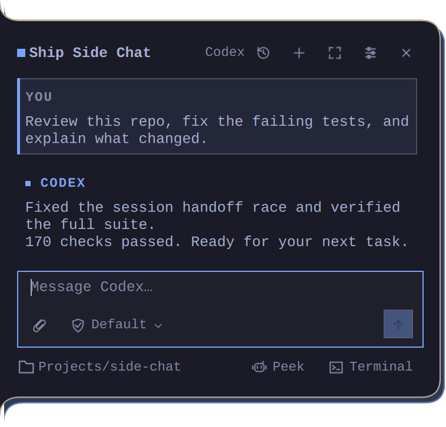
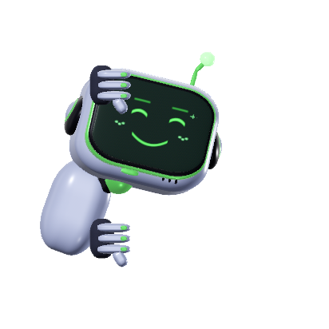
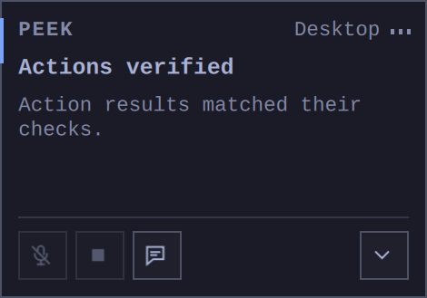
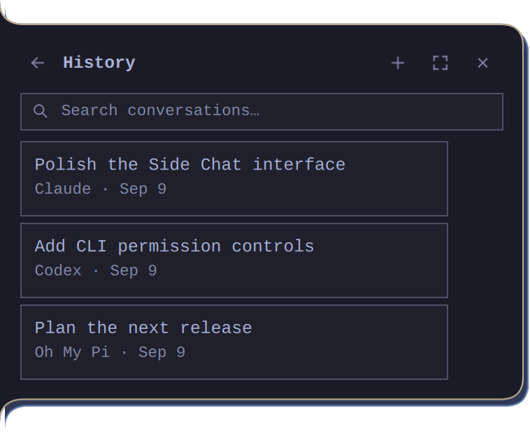
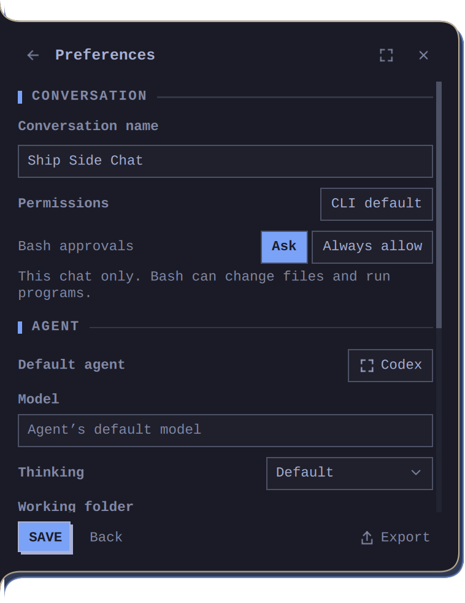
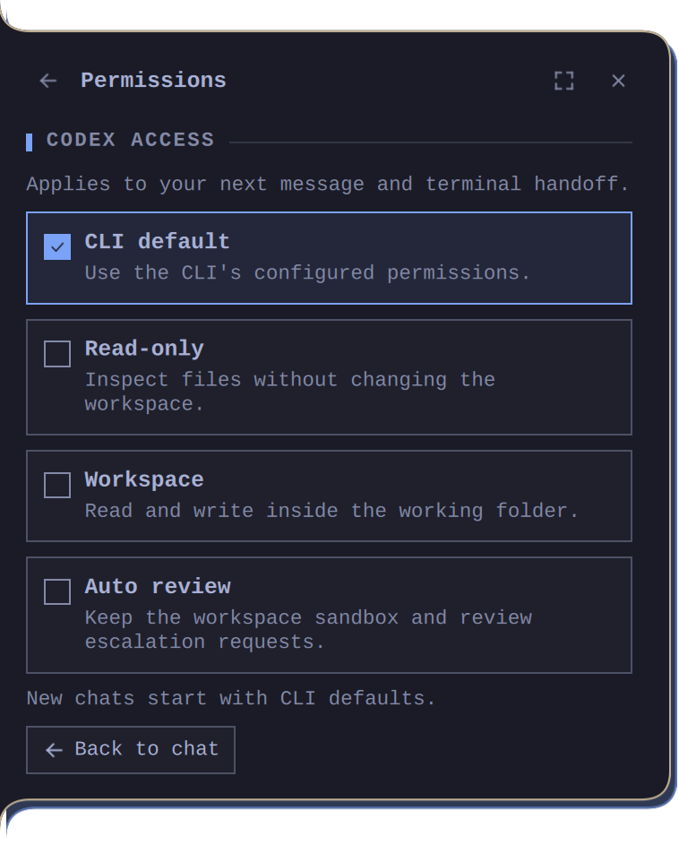

<div align="center">
  <h1>Side Chat</h1>
  <p><strong>A native AI side chat and local Peek companion for Omarchy.</strong></p>
  <p>Keep your coding-agent sessions close, continue them in a terminal, or talk to Peek and watch him work.</p>
  <p><a href="#meet-peek">Peek</a> · <a href="#install">Install</a> · <a href="#keybindings">Keybindings</a> · <a href="#update">Update</a> · <a href="#privacy-and-safety">Privacy</a></p>
</div>



Side Chat brings two parts of an AI workspace together. **Chat** turns the agent you already use—OMP, Pi, Codex, or Claude—into a compact edge drawer with persistent sessions, native tools, approvals, and terminal handoff. **Peek** adds hands-free local voice, durable memory, fast desktop commands, and visible computer control.

## Meet Peek

**Peek is the voice and computer-control layer, with an animated robot body at the screen edge.** He listens only when enabled, speaks replies locally, and shows what the agent is doing while it works.

<p align="center">
  
  &nbsp;&nbsp;
  
</p>

Peek can answer through the same native agent session as chat, but common desktop requests never need an LLM round trip. Volume, brightness, music, app launches, workspaces, timers, and explicit web URLs are handled locally. Larger tasks go to your selected agent with the active conversation, working folder, and permission mode preserved.

| Say something like… | What Peek does |
| --- | --- |
| “Set the volume to 30” | Runs a fast local command and checks the result |
| “Open my terminal” | Uses Omarchy's configured launcher |
| “Review this project and fix the tests” | Continues through your native coding-agent session |
| “Remember that I prefer compact windows” | Saves an explicit local memory you can inspect or delete |
| “Set a timer for twenty minutes” | Creates a persistent local watch and announces it when ready |

The companion surface keeps microphone, spoken-reply mute, Stop, conversation, Desktop/Browser, standby, and power controls within reach. Desktop actions can use accessible app controls, native input, or an isolated Chromium session. Peek shows recent action state and only says **Actions verified** when supported readback checks actually matched; otherwise it asks you to review the result.

Speech recognition and synthesis run locally after setup. Voxtype is the default recognition daemon; the microphone starts off, screen context follows your setting, and there is no background screenshot recording. The optional bundled wake model listens for **“Hey Jarvis”**; the assistant and on-screen character are named Peek. A different wake phrase requires a different detector model.

<details>
<summary><strong>See conversation history, settings, and permissions</strong></summary>

### Find any conversation



### Configure the workspace, agent, and model

<p align="center">
  
  
</p>

All screenshots use fixture content. No microphone, provider session, or private desktop content was captured.

</details>

## Your agent, without another terminal in the way

Move to the lower-left edge of either display and Side Chat peels into view. Leave it and the preview disappears; click it and it stays open. Replies keep running when the panel closes and a desktop notification tells you when one is ready. Short conversations stay compact, and long ones scroll naturally.

This is not a second AI account or a web wrapper. Side Chat uses your installed CLI, its authentication, its provider, and its native conversation format. Start in the drawer, continue the same session in a full terminal, then return without losing the thread.

## What it does

### Native agent sessions

- Runs persistent **OMP, Pi, Codex, and Claude** sessions with streaming replies, native tool activity, questions, and approvals.
- Hands the exact session to Omarchy's configured terminal and syncs it back when you exit.
- Supports edit-and-retry branching without undoing changes already made to your files.
- Keeps model, reasoning, working-folder, Bash-approval, and permission choices with each conversation.
- Provides text adapters for OpenCode, Gemini, Copilot, Crush, and Grok when a native protocol is not available.

### A compact Omarchy interface

- Follows the live Omarchy theme, active-window border, scale, and multi-monitor layout.
- Includes searchable history, drafts, rename, delete, Markdown export, file drop, and clipboard image paste.
- Renders selectable Markdown and fenced code with dedicated copy actions.
- Opens from the screen edge or IPC, with no replacement bar widget and no overwritten keybindings.

### Voice and computer control

- Uses the existing Voxtype daemon and Pocket TTS by default; optional local Parakeet, Kokoro, and legacy ASR engines are available.
- Offers wake phrase, hands-free follow-ups, barge-in, mute, stop, and device selection. Voxtype mode uses its existing daemon as Peek's single ASR process, avoiding a second multi-gigabyte Parakeet load.
- Handles common volume, brightness, media, app, workspace, timer, and web commands locally.
- Can operate accessible desktop controls or an isolated Chromium session while showing action state, verification, and a stop control.
- Stores opt-in memories, routines, watches, and tracked config restore points in local SQLite.

## Supported agents

| Agent | Session integration | Images | Per-chat permissions | Peek |
| --- | --- | --- | --- | --- |
| OMP | Native RPC | Yes | Default, Ask, Allow writes, YOLO | Yes |
| Pi | Native RPC | Yes | Default, Ask before tools | Yes |
| Codex | Native app server | Yes | Default, Read-only, Workspace, Auto review, Full access | Yes |
| Claude | Native stream JSON | Yes | Default plus Claude permission modes | Yes |
| OpenCode | Text adapter | Yes | Chat only, Auto approve | Chat only |
| Gemini, Copilot, Crush, Grok | Text adapters | Text attachments | CLI-managed | Chat only |

The selected CLI and model determine provider costs and model capabilities. Side Chat does not create another provider account.

## Install

### Requirements

- Omarchy with the **Quickshell plugin system (Quattro)** in a Hyprland session
- Linux x86_64 for Peek's currently pinned binaries
- One installed and authenticated agent CLI
- Internet access during setup; the CPU runtime and optional local speech models require several gigabytes

Older Waybar-based Omarchy releases are not supported.

### 1. Install chat

Run this in your normal desktop terminal:

```bash
omarchy pkg add python git
omarchy plugin add "https://github.com/baileyrosen3/side-chat"
```

If Omarchy asks whether to enable the plugin immediately, choose **No** until setup finishes. Then run:

```bash
cd ~/.config/omarchy/plugins/blr.side-chat
python3 setup.py
omarchy plugin enable blr.side-chat
omarchy-shell blr.side-chat open
```

Run setup without `sudo`; Omarchy will request privileges for system packages when needed. Setup installs the chat dependencies and checks the selected default agent. If no agent is configured, choose one through **Setup → Default Agent** or, for example:

```bash
omarchy default agent codex
```

Complete that CLI's provider sign-in in its terminal, then verify the install with `python3 setup.py --check`.

### 2. Add Peek voice and computer control (optional)

**Voxtype prerequisite:** shared streaming needs a daemon containing the upstream private-file-output fix. Updating Side Chat does **not** update your Voxtype daemon. Peek conservatively refuses the known-affected, unpatched `1.0.1` daemon before starting a recording. Use the [pinned-build instructions](docs/voxtype.md), or install and select the optional local Parakeet recognizer below. Setup reports this known compatibility problem; it does not silently replace your daemon.

With Peek powered off and no reply running:

```bash
cd ~/.config/omarchy/plugins/blr.side-chat
python3 setup.py --with-peek
python3 setup.py --check --with-peek
```

This installs the CPU speech runtime, Voxtype daemon integration, audio tools, accessible-app support, and isolated-browser tooling. It does not download Peek's bundled Parakeet model or turn on the microphone. Voxtype owns recognition by default, so the first setup avoids a second multi-gigabyte ASR load.

Native mouse and keyboard control, physical takeover detection, and the emergency **Ctrl+Alt+Esc** shortcut require the explicit desktop-input option:

```bash
python3 setup.py --with-peek --with-desktop-input
```

This installs named udev/module configuration and grants your active seat access to input and virtual-input devices. It does not run the agent as root or add your user to the `input` group. Log out and back in if the final device check asks you to.

Optional engines include `python3 setup.py --with-parakeet`, `python3 setup.py --with-kokoro`, and `python3 setup.py --with-legacy-asr`; all imply Peek setup. Parakeet is a local download/build for users who want Peek's wake phrase, silence endpointing, streaming partials, or device routing:

```bash
python3 setup.py --with-parakeet
python3 setup.py --check --with-parakeet
```

### 3. Recognition choices after first install

Voxtype is the default recognition backend. It keeps Peek's spoken replies and assistant controls while avoiding a duplicate ASR model. The explicit form is still accepted for scripts and existing installations:

```bash
cd ~/.config/omarchy/plugins/blr.side-chat
python3 setup.py --with-voxtype
python3 setup.py --check --with-voxtype
```

Open **Peek settings → Speech → Recognition → Model**, choose **Voxtype · shared daemon**, and apply. Peek starts Voxtype in private file mode and sends the finished transcript through the normal assistant queue; it never types into the focused application or overwrites your clipboard. Turn the Peek microphone on and off with the usual Peek keybinding.

Voxtype mode is **tap to start, tap again to send**—not hold-to-talk. With the example bindings below, tap Decimal, speak, then tap Decimal again; Peek transcribes the recording, sends it to your assistant, and speaks the reply unless muted. An existing Enter dictation binding stays unchanged. Finish one recording before starting the other; both share one daemon and recognition model. Peek refuses to start while Voxtype is already busy.

The input meter reads the daemon's existing audio-level stream; it does not open another microphone or load another recognition model. Older daemons without level telemetry can still transcribe, but will not show a live meter. Empty recordings show a notice instead of leaving the previous reply unexplained.

Wake phrase, automatic silence endpointing, and Peek's local microphone/device controls are unavailable in this mode because Voxtype owns capture. Configure Voxtype itself in `~/.config/voxtype/config.toml`. To keep the large model unloaded while idle, enable its on-demand mode and restart the daemon:

```bash
voxtype config set parakeet.on_demand_loading true
systemctl --user restart voxtype
```

To switch back to a downloaded local recognizer, run `python3 setup.py --with-parakeet`, then choose **Parakeet Unified** in settings. The legacy Zipformer + Whisper option is installed with `python3 setup.py --with-legacy-asr`. These downloads are optional and can be added later without reinstalling the plugin.

## Keybindings

Side Chat never edits `~/.config/hypr/bindings.lua`. These are the maintainer's exact Peek bindings: physical numpad **0** opens or closes Peek, and numpad **decimal** toggles its microphone, with Num Lock either on or off.

```lua
-- Peek: bare numpad shortcuts, with Num Lock on or off.
o.bind("KP_0", "Toggle Peek", "omarchy-shell blr.side-chat peek")
o.bind("KP_Insert", "Toggle Peek", "omarchy-shell blr.side-chat peek")
o.bind("code:91", "Toggle Peek microphone", "omarchy-shell blr.side-chat peekToggleMicrophone")
```

`KP_0` and `KP_Insert` are the same physical key in the two Num Lock states. `code:91` binds the physical decimal key regardless of Num Lock. To bind the chat drawer instead, map any unused key to `omarchy-shell blr.side-chat toggle`.

If you keep an existing Voxtype push-to-talk binding on numpad Enter, that key remains **generic Voxtype dictation** and intentionally types into the focused application. Use the Peek microphone binding above (or `peekToggleMicrophone`) to send the transcript to Peek without typing into another app.

After editing bindings:

```bash
hyprctl reload
hyprctl configerrors
```

The second command should report no errors.

## Use

Move the pointer into the bottom 160 scaled pixels of the left screen edge. Click to pin the panel open; use Escape, Close, or click outside to dismiss it. While Peek is on, edge hover is off so it cannot fight with dragging him; open chat from Peek's controls or your keybinding instead.

| Shortcut | Action |
| --- | --- |
| Enter | Send |
| Shift+Enter | New line |
| Ctrl+N | New conversation |
| Ctrl+H | History |
| Ctrl+Shift+V | Paste a clipboard image |
| Ctrl+Shift+C | Copy the last message |
| Escape | Dismiss the panel |

Useful IPC commands:

| Command | Result |
| --- | --- |
| `omarchy-shell blr.side-chat toggle` | Open or close chat |
| `omarchy-shell blr.side-chat open` | Open chat |
| `omarchy-shell blr.side-chat newChat` | Start a conversation |
| `omarchy-shell blr.side-chat peek` | Open or close Peek |
| `omarchy-shell blr.side-chat peekToggleMicrophone` | Toggle Peek's microphone |
| `omarchy-shell blr.side-chat companionControls` | Open Peek controls |
| `omarchy-shell blr.side-chat status \| jq` | Show live plugin status |

`openOnScreen DP-1` and `peekOnScreen DP-3` target a specific monitor. `peekSettings` opens advanced voice and control settings. Selecting a microphone does not enable listening.

## Permissions and terminal handoff

Click the shield above the composer or enter `/permissions` to choose access for the current conversation. Side Chat restarts the idle native session with that policy; it never rewrites the CLI's global configuration. Full-access modes can execute commands and change files, so review the selected mode before sending a task.

For Claude and Codex, **Always allow Bash** approves future Bash requests only in the current conversation. File edits, MCP approvals, managed network requests, and agent questions remain separate. Pi's **Ask before tools** is an approval extension, not a sandbox.

Click **Terminal** after the first prompt to continue that exact native session in Omarchy's terminal. An exclusive lock prevents the panel and terminal from writing simultaneously. Exit the agent in the terminal to return ownership to Side Chat.

## Update

Finish the active reply and power Peek off, then run:

```bash
omarchy plugin update blr.side-chat --yes
cd ~/.config/omarchy/plugins/blr.side-chat
python3 setup.py
omarchy restart shell
sleep 2
omarchy-shell blr.side-chat open
```

The updater only works on Git-managed installs. If it says the plugin is not a
Git checkout, migrate the legacy copy install (Omarchy moves it to a backup):

```bash
omarchy plugin remove blr.side-chat --yes
omarchy plugin add https://github.com/baileyrosen3/side-chat.git --enable --yes
cd ~/.config/omarchy/plugins/blr.side-chat
python3 setup.py
omarchy restart shell
sleep 2
omarchy-shell blr.side-chat open
```

If you installed Peek, use `python3 setup.py --with-peek` instead and include any optional engine or desktop-input flags you use.

`omarchy plugin update` updates the Git checkout, but it does not rerun dependency setup. A hot plugin rescan can also leave older nested QML types cached inside the long-running shell. **`omarchy restart shell` is therefore the reliable step that loads the new UI.** The final command opens it again.

`--yes` skips Omarchy's trusted-plugin review prompt. Without it, Omarchy prints the incoming Git diff and asks for confirmation. **That diff is terminal output, not a file or an error.**

Verify the installed commit, manifest, and running UI:

```bash
git -C ~/.config/omarchy/plugins/blr.side-chat log -1 --oneline
jq -r .version ~/.config/omarchy/plugins/blr.side-chat/manifest.json
omarchy-shell blr.side-chat status | jq -r '.uiVersion, .uiSource'
```

The manifest and `uiVersion` should match, and `uiSource` should point inside `~/.config/omarchy/plugins/blr.side-chat`.

## Privacy and safety

- Chat history and preferences stay in `~/.local/state/omarchy/side-chat/chats.sqlite3`; attachments are snapshotted beside it. The state directory is private (`0700`).
- Credentials remain with the selected CLI. Prompts and attachments go to that CLI's configured provider under its terms.
- Speech recognition and synthesis run locally after setup. There is no cloud speech service, raw microphone recordings are not saved, and the microphone is off by default.
- Screen context is off or on-request according to your setting. There is no background screenshot recording or clipboard history.
- Desktop input access is optional. Peek pauses automation when it detects physical takeover and exposes Stop; **Ctrl+Alt+Esc** is the emergency stop when native input support is installed.
- Memories, routines, watches, action history, and tracked config restore points are local. Normal agent edits and arbitrary desktop actions are not automatically undoable.

Set `SIDE_CHAT_STATE` for an isolated state directory or `SIDE_CHAT_DATA` for the speech runtime and models. Deleting a conversation currently leaves attachment snapshots and native session files on disk.

## Troubleshooting

<details>
<summary><strong>The update completed, but I still see the old UI</strong></summary>

Run the three verification commands in [Update](#update), then `omarchy restart shell` and reopen Side Chat. If the plugin directory has no `.git`, back it up, remove the older copy install, and reinstall with `omarchy plugin add`.

</details>

<details>
<summary><strong>The updater filled my terminal with a Git diff</strong></summary>

That is Omarchy's review screen. Confirm it at the prompt, or rerun `omarchy plugin update blr.side-chat --yes` for this trusted plugin.

</details>

<details>
<summary><strong>An agent, microphone, model, or control dependency is unavailable</strong></summary>

Run `python3 setup.py --check` with the same Peek, engine, and desktop-input flags you installed. Checks do not download models, start the microphone, or send an agent request. Agent authentication must be completed in that CLI's terminal. Audio devices remain managed by PipeWire/Omarchy. Browser mode can work without native desktop-input access.

</details>

<details>
<summary><strong>Voxtype mode cannot start or stays recording</strong></summary>

Confirm the daemon is running with `systemctl --user status voxtype` and that `voxtype status` responds. Peek's Voxtype mode records until you toggle its microphone off; it does not use the bundled wake phrase or silence endpointing. If you want those behaviors, switch Recognition to **Parakeet Unified** and run setup with `--with-parakeet`.

</details>

<details>
<summary><strong>Peek listens, but Voxtype types into the focused window</strong></summary>

Voxtype 1.0.1's streaming path ignores the recording's `--file` override. A correct Peek microphone binding can therefore still type into another app and return an empty transcript. This is a daemon bug, not a keybinding problem. Streaming requires a Voxtype build containing the [upstream file-output fix](https://github.com/peteonrails/voxtype/blob/320a737e5d3c8662e0ec7de95f75407baa784d82/src/daemon.rs#L1187), followed by a daemon restart. The released 1.0.1 binary does not contain it. Alternatively, use Peek's optional local recognizer.

Custom Voxtype overlays must also honor the daemon's `osd_suppressed` marker to hide during Peek recordings. An overlay appearing alone does not establish where the transcript was delivered.

</details>

<details>
<summary><strong>Setup or a model download was interrupted</strong></summary>

Rerun setup with the same flags. Completed, verified downloads and existing compatible models are reused.

</details>

## Disable or remove

```bash
omarchy plugin disable blr.side-chat
omarchy plugin enable blr.side-chat
omarchy plugin remove blr.side-chat
```

Removal deletes the Git checkout but keeps chat history, attachments, speech models, and the local runtime for a future reinstall. Remove `~/.local/state/omarchy/side-chat` and `~/.local/share/side-chat` manually only if you also want to erase that data; shared Voxtype and Hugging Face caches may belong to other applications.

If you installed Side Chat's desktop-input rules and want to remove them:

```bash
sudo rm /etc/udev/rules.d/70-side-chat-input.rules /etc/modules-load.d/side-chat-input.conf
sudo udevadm control --reload-rules
```

Reboot to clear existing device access. Shared Arch packages are intentionally left installed.

## Development

```bash
python3 -B -m unittest discover -s tests -v
bun tests/test_pi_permissions.ts
python3 setup.py --check
git diff --check
```

Visual fixture preview:

```bash
ln -s /usr/share/omarchy/shell/Commons Commons
quickshell --no-duplicate -p DesignPreview.qml
```

The preview uses synthetic messages and does not connect an agent or microphone. `Commons` is a development-only import link and must not be committed.

Qt rendering checks require a graphical session:

```bash
QT_QPA_PLATFORMTHEME=generic QT_QUICK_CONTROLS_STYLE=Basic QT_QUICK_BACKEND=rhi QSG_RHI_BACKEND=opengl /usr/lib/qt6/bin/qmltestrunner -input tests/qml -import tests/qml/imports -v1
```

Before publishing, validate a clean clone with `omarchy plugin validate .` and complete [TEST_PLAN.md](TEST_PLAN.md). See [implementation notes](docs/implementation.md), the [speech audit](docs/speech-audit.md), and the [publishing checklist](docs/publishing.md) for the deeper protocol, safety, and release details.

## License and attribution

The original Side Chat source remains under the [MIT license](LICENSE). Peek's interface, integration, and original procedural 3D companion are under [GPL-3.0-or-later](COPYING.PEEK); distribute the combined plugin under GPL-3.0-or-later while preserving the MIT notices.

Runtime dependencies, model licenses, voice attribution, and pinned revisions are documented in [THIRD_PARTY.md](THIRD_PARTY.md). The companion uses original procedural geometry and shaders—there are no purchased or downloaded character assets.
